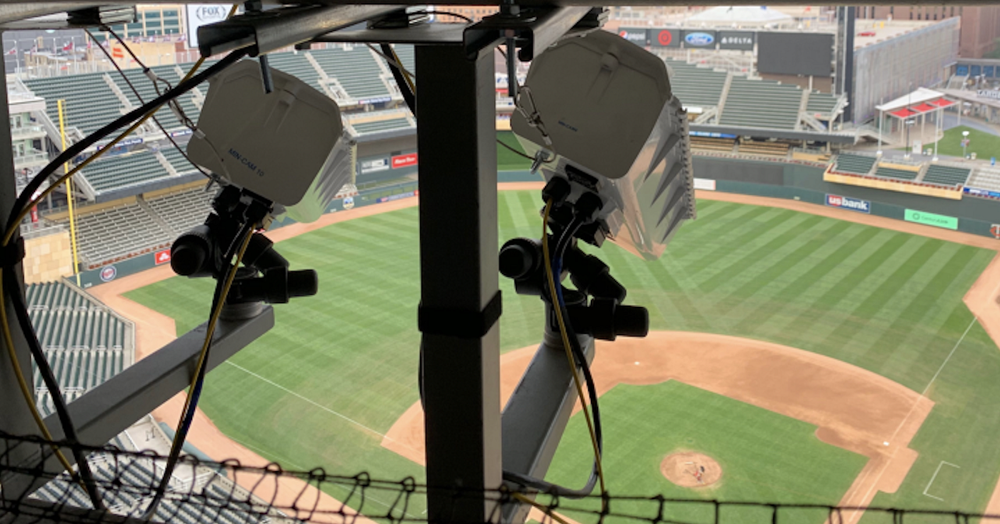
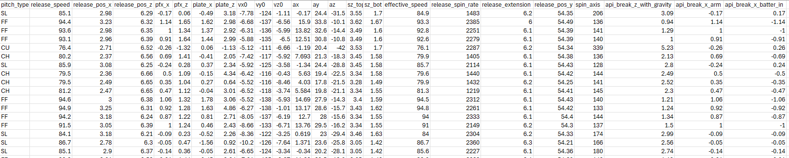
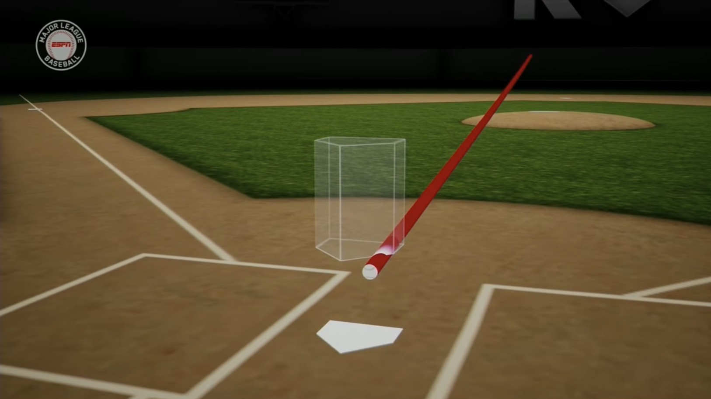

```{r}
library(tidyverse)
library(factoextra)
library(rpart)
library(randomForest)
library(xgboost)
library(caret)
library(DiagrammeR)
library(DiagrammeRsvg)
library(rsvg)
library(rpart.plot)
library(visNetwork)
library(sparkline)

full_data <- read.csv('./data/Skubal_All.csv') %>%
  drop_na() %>%
  filter(!pitch_type %in% c("FS", "FC", "KC", "")) %>% 
  mutate(pitch_type = as.factor(pitch_type))

numeric_vars <- full_data %>% 
  select(release_speed:api_break_x_batter_in)
# Pre-filter for pitches that have enough data
full <- readRDS('./data/23_24_pitch_data.rds') %>%
  filter(pitch_type != "") %>%
  drop_na(pitch_type)

common_pitches <- full %>% 
  group_by(pitch_type) %>% 
  filter(n() >= 5000) %>% 
  ungroup() %>%
  pull(pitch_type) %>%
  unique()

full_filtered <- full %>%
  filter(pitch_type %in% common_pitches) %>%
  mutate(pitch_type = factor(pitch_type))

```

## Introduction: The Statcast Era

-   **MLB Data Explosion:** Detailed kinematic and location data is now available for nearly every MLB pitch.

-   **Real-Time Classification:** MLB stadiums instantly classify pitches using live data and machine learning.

-   **Objective:** Look under the hood of this process by building a predictive pitch classification model.

    <center>{width="453"}</center>

## Motivation & Project Goals

-   **Target Subject:** Tarik Skubal (Detroit Tigers).

-   **Techniques:** Principal Component Analysis (PCA) and Clustering.

-   **Core Research Questions:**

    1.  How accurately can pitch types be predicted using purely kinematic data?
    2.  Which specific variables carry the most weight in predicting a pitch?
    3.  Can this modeling framework be easily scaled to evaluate other pitchers?

## Data & Tools

-   **Data Source:** baseballsavant.mlb.com

-   **Collection Tool:** `pybaseball` (Open-source Python package by James LeDoux).

-   **Dataset Scope:** 2020–2025 pitch-by-pitch data.

-   **Pre-classified Targets:** The dataset includes MLB's official pitch classifications to evaluate model accuracy.

-   **Filtered the Raw Dataset:** Down to 23 numeric predictor variables, 1 binary classifier

    

## Understanding the Predictor Variables (1)

-   x -\> the horizontal direction, from the center of homeplate

-   y -\> the baseball's distance from home-plate

-   z-\> vertical direction, from middle of strikezone

    -   Ex: (x, z) = (0,0) would be the exact middle of the strikezone

-   ax/y/z -\> acceleration of the pitch in that respective direction

    {width="528"}

## Understanding the Predictor Variables (2)

-   plate_x,z -\> where the pitch crosses home-plate in the x, z coordinates

-   release_pos_x/z -\> x, z coordinates of were the ball leaves the pitchers hand

-   release_pos_y -\> how far away from the plate the pitcher relases the ball

-   api_break_x -\> how far the pitch moves from x, z release point to x, z plate coords, after accounting for gravity

    {width="521"}

## Understanding the Predictor Variables (3)

-   **Binary Classifier:** Right vs Left Handedness

-   Spin Axis vs Spin Rate(rpm)

-   Release Speed - Raw Velocity the moment it leaves pitchers hand

-   Effective Speed - basically the perceived speed to a batter; pitcher extension affects this.

## PCA - Biplot

```{r}
pca_data_full <- numeric_vars %>%
  rename(
    "Velocity"             = release_speed,
    "Induced Hor. Break"      = pfx_x,
    "Induced Vert. Break"     = pfx_z,
    "Total Vert. Drop" = api_break_z_with_gravity,
    "Accel-X"          = ax,
    "Acceleration-Y"          = ay,
    "Accel-Z"          = az,
    "Spin Rate"               = release_spin_rate,
    "Spin Axis"               = spin_axis
  )

pca_fit <- prcomp(pca_data_full, scale = TRUE)

summary(pca_fit)
vars_to_display <- c(
  "Velocity",
  "Induced Hor. Break", 
  "Induced Vert. Break",
  "Total Vert. Drop",
  "Accel-X", 
  "Accel-Z",
  "Spin Rate",
  "Spin Axis"
)

# color legend
pitch_colors <- c("#009ADE", "#50A315", "#E16A86", "#C86DD7", "#00AD9A")

fviz_pca_biplot(pca_fit,
                geom.ind = "point",
                col.ind = full_data$pitch_type,
                palette = pitch_colors,
                addEllipses = FALSE,
                ellipse.type = "convex",
                legend.title = "Pitch Type",
                pointshape = 18,
                alpha.ind = 0.4,
                select.var = list(name = vars_to_display), 
                col.var = "black",
                repel = TRUE) +
  labs(title = "PCA Biplot: Velocity vs. Movement") +
  theme_minimal() +
  theme(legend.position = "bottom")

# Generate the Scree Plot
fviz_eig(pca_fit, 
         ncp = 23,               # Shows all 23 Principal Components
         choice = "variance",    # Plots the percentage of variance explained
         addlabels = FALSE,      # Keeps it clean without numbers on every bar
         barfill = "steelblue", 
         barcolor = "black") + 
  labs(
    title = "Scree Plot", 
    x = "Principal Components", 
    y = "Percentage of Explained Variance"
  ) +
  theme_classic() +
  theme(
    plot.title = element_text(size = 16, face = "bold", hjust = 0.5),
    axis.title.x = element_text(size = 12, face = "bold"),
    axis.title.y = element_text(size = 12, face = "bold")
  )
```

## Model Building

```{r}
set.seed(326)
n <- nrow(full_data)

train_idx <- sample(1:n, size = 0.7 * n)
train_data <- full_data[train_idx, ]

remaining_data <- full_data[-train_idx, ]
n_rem <- nrow(remaining_data)
test_idx <- sample(1:n_rem, size = (2/3) * n_rem)

test_data <- remaining_data[test_idx, ]
val_data  <- remaining_data[-test_idx, ]
```

-   Model will be build using XGBoost

-   **XGBoost:** A collection of decision trees, similar to that of a CART or Random Forest

-   **Training Set:** 70%

-   **Testing Set:** 20%

-   **Validation Set:** 10%

## CART

```{r}
cart_fit <- rpart(pitch_type ~ ., data = train_data, method = "class")
cart_pred <- predict(cart_fit, test_data, type = "class")

# Visual
graph_widget <- visTree(cart_fit, 
                        main = "Pitch Type Classification Tree", 
                        width = "100%", 
                        height = "500px", 
                        nodesPopSize = TRUE) %>% 
  visNodes(font = list(size = 26, face = "bold", color = "black")) %>%
  visEdges(font = list(size = 18, align = "horizontal", background = "white", strokeWidth = 0)) %>% 
  visHierarchicalLayout(direction = "UD", levelSeparation = 200, nodeSpacing = 250) %>% 
  visOptions(highlightNearest = list(enabled = TRUE, degree = 1)) %>%
  visInteraction(dragNodes = TRUE, zoomView = TRUE)

graph_widget
```

## Example of XGBoost Tree

-   Small model, depth of 3

## XGBoost- focus of machine learning model

```{r}
train_x <- data.matrix(select(train_data, -pitch_type))
train_y <- as.numeric(train_data$pitch_type) - 1

test_x  <- data.matrix(select(test_data, -pitch_type))
test_y  <- as.numeric(test_data$pitch_type) - 1

dtrain <- xgb.DMatrix(data = train_x, label = train_y)
dtest  <- xgb.DMatrix(data = test_x, label = test_y)

xgb_fit <- xgb.train(
  params = list(
    objective = "multi:softmax",
    num_class = length(unique(train_y))
  ),
  data = dtrain,
  nrounds = 100,
  verbose = 0
)
# pitch names
pitch_levels <- levels(test_data$pitch_type)
# predict and check accuracy of model
preds <- predict(xgb_fit, dtest)
preds_named <- factor(pitch_levels[preds + 1], levels = pitch_levels)
actuals_named <- factor(pitch_levels[test_y + 1], levels = pitch_levels)

confusionMatrix(preds_named, actuals_named)
```

## Model Generalization

*The model achieves 99% balanced accuracy on Skubal's pitches.*

**How does it perform on other pitchers?**

-   **Ryan Weathers:** LHP. Similar arsenal, but throws a sweeper instead of a traditional curveball.

-   **Patrick Sandoval:** LHP. Throws the exact same 5 pitches as Skubal, but with a less elite movement profile.

-   **Jake Arrieta:** RHP. Retired, but threw mostly the same pitch mix.

## Generalization - Ryan Weathers

```{r}
#| fig-asp: 1

weathers <- read.csv("./data/weathers_full.csv") %>%
  drop_na() %>%
  filter(pitch_type != "")

preds_weathers <- weathers %>% 
  select(colnames(train_x)) %>% 
  data.matrix() %>% 
  xgb.DMatrix() %>% 
  predict(xgb_fit, .) %>% 
  {levels(train_data$pitch_type)[. + 1]} 

u_levels <- union(unique(preds_weathers), unique(weathers$pitch_type))
pred_fac <- factor(preds_weathers, levels = u_levels)
act_fac  <- factor(weathers$pitch_type, levels = u_levels)

cm1 <- confusionMatrix(pred_fac, act_fac)

as.data.frame(cm1$table) %>%
  group_by(Reference) %>%
  mutate(Pct = Freq / sum(Freq)) %>%
  ggplot(aes(Prediction, Reference, fill = Pct)) +
  geom_tile() +
  geom_text(aes(label = scales::percent(Pct, accuracy = 1)), color = "white") +
  scale_fill_gradient(low = "gray87", high = "forestgreen", labels = scales::percent) + 
  labs(title = "Prediction Accuracy % by Pitch Type (Weathers)", x = "Predicted", y = "Actual") +
  theme_minimal()
```

-   Balanced Accuracy =

-   Does a good job with Sliders, Changeups, and Sinkers.

-   Misclassified some fastballs as sinkers.

-   Weathers throws a Sweeper instead of a Curveball.

    -   A sweeper is somewhere between a slider and curveball

    -   Classifications mixed between slider and curveball

## Generalization - Patrick Sandoval

```{r}
#| fig-asp: 1

sandoval <- read.csv("./data/sandoval_full.csv") %>%
  drop_na() %>%
  filter(pitch_type != "")

preds_sand <- sandoval %>% 
  select(colnames(train_x)) %>% 
  data.matrix() %>% 
  xgb.DMatrix() %>% 
  predict(xgb_fit, .) %>% 
  {levels(train_data$pitch_type)[. + 1]} 

u_levels <- union(unique(preds_sand), unique(sandoval$pitch_type))
pred_fac <- factor(preds_sand, levels = u_levels)
act_fac  <- factor(sandoval$pitch_type, levels = u_levels)

cm2 <- confusionMatrix(pred_fac, act_fac)

as.data.frame(cm2$table) %>%
  group_by(Reference) %>%
  mutate(Pct = Freq / sum(Freq)) %>%
  ggplot(aes(Prediction, Reference, fill = Pct)) +
  geom_tile() +
  geom_text(aes(label = scales::percent(Pct, accuracy = 1)), color = "white") +
  scale_fill_gradient(low = "gray87", high = "forestgreen", labels = scales::percent) + 
  labs(title = "Prediction Accuracy % by Pitch Type (Sandoval)", x = "Predicted", y = "Actual") +
  theme_minimal()
```

-   Overall the model generalizes very well to Sandoval

-   Balanced Accuracy =

    -   97%+ accuracy for slider, curveball, fastball, changeup.

    -   Sinker did alright, misclassified often.

    -   Sweeper again classified as curveball or slider.

## Generalization - Jake Arrieta

```{r}
#| fig-asp: 1
arrieta <- read.csv("./data/arrieta_full.csv") %>%
  drop_na() %>%
  filter(pitch_type != "")

preds_arrieta <- arrieta %>% 
  select(colnames(train_x)) %>% 
  data.matrix() %>% 
  xgb.DMatrix() %>% 
  predict(xgb_fit, .) %>% 
  {levels(train_data$pitch_type)[. + 1]} 

u_levels <- union(unique(preds_arrieta), unique(arrieta$pitch_type))
pred_fac <- factor(preds_arrieta, levels = u_levels)
act_fac  <- factor(arrieta$pitch_type, levels = u_levels)

cm4 <- confusionMatrix(pred_fac, act_fac)

as.data.frame(cm4$table) %>%
  group_by(Reference) %>%
  mutate(Pct = Freq / sum(Freq)) %>%
  ggplot(aes(Prediction, Reference, fill = Pct)) +
  geom_tile() +
  geom_text(aes(label = scales::percent(Pct, accuracy = 1)), color = "white") +
  scale_fill_gradient(low = "gray87", high = "forestgreen", labels = scales::percent) + 
  labs(title = "Prediction Accuracy % by Pitch Type (Arrieta)", x = "Predicted", y = "Actual") +
  theme_minimal()
```

-   Generalizing the model to a RHP didn't do very well

-   Balanced Accuracy =

-   Makes logical sense, RHP and LHP throw from opposite sides

    -   So when a RHP throws a slider it breaks left, while for a LHP it breaks right.

    -   This would mean for a variable like api_break_x_arm we would get a positive value for a LHP, and a negative value for a RHP.

    -   This will clearly cause classification issue when trying to split on x-axis based variables.

## Scaling Up - Random Sample

-   Can a more general model be built off a random sample of ALL pitchers?

-   A sample size of n will be drawn from a data frame with 1.5 million pitches from 2023-2024.

-   Right and Left Handed Models built separately for each n.

-   Unbalanced Data; we will look at balanced accuracy.

-   At what n do we see a diminishing return for our model?

```{r}
# Pre-filter for pitches that have enough data
full <- readRDS('./data/23_24_pitch_data.rds') %>%
  filter(pitch_type != "") %>%
  drop_na(pitch_type)

common_pitches <- full %>% 
  group_by(pitch_type) %>% 
  filter(n() >= 5000) %>% 
  ungroup() %>%
  pull(pitch_type) %>%
  unique()

full_filtered <- full %>%
  filter(pitch_type %in% common_pitches) %>%
  mutate(pitch_type = factor(pitch_type))

# grid of n
n_values <- c(1000, 2500, 5000, 10000, 15000, 25000, 35000)

# iterations
iterations <- 5
```

## How Large of a Sample do I need?

::::: {layout="[50, 50]"}
<div>

```{r}
#| label: rhp-xgboost-learning-curve
#| cache: true
#| warning: false
#| message: false
#| fig-asp: 1

data_R <- full_filtered %>% 
  filter(p_throws == "R") %>% 
  dplyr::select(-p_throws) %>% 
  droplevels()
data_R <- as.data.frame(data_R)

X_R <- data.matrix(dplyr::select(data_R, -pitch_type))
Y_R <- as.numeric(data_R$pitch_type) - 1
classes_R <- levels(data_R$pitch_type)
num_classes_R <- length(classes_R)

results_R <- numeric(length(n_values)) 

for(i in seq_along(n_values)) {
  
  n <- min(n_values[i], nrow(X_R))
  iter_acc <- numeric(iterations)
  
  for(j in 1:iterations) {
    samp_idx <- sample(nrow(X_R), n)
    train_idx <- sample(samp_idx, floor(0.8 * n))
    test_idx  <- setdiff(samp_idx, train_idx)
    
    dtrain <- xgb.DMatrix(data = X_R[train_idx, ], label = Y_R[train_idx])
    dtest  <- xgb.DMatrix(data = X_R[test_idx, ], label = Y_R[test_idx])
    
    fit <- xgb.train(
      params = list(objective = "multi:softmax", num_class = num_classes_R, tree_method = "hist"),
      data = dtrain, nrounds = 50, verbose = 0
    )
    
    preds <- predict(fit, dtest)
    pred_fac <- factor(classes_R[preds + 1], levels = classes_R)
    test_fac <- factor(classes_R[Y_R[test_idx] + 1], levels = classes_R)
    
    cm <- confusionMatrix(pred_fac, test_fac)
    
    if(is.matrix(cm$byClass)) {
      iter_acc[j] <- mean(cm$byClass[, "Balanced Accuracy"], na.rm = TRUE)
    } else {
      iter_acc[j] <- cm$byClass["Balanced Accuracy"]
    }
  }
  
  results_R[i] <- mean(iter_acc)
}

plot_data_R <- data.frame(N = n_values, Balanced_Accuracy = results_R)

ggplot(plot_data_R, aes(x = N, y = Balanced_Accuracy)) +
  geom_line(color = "firebrick", linewidth = 1) +
  geom_point(color = "firebrick", size = 2) +
  scale_y_continuous(labels = scales::percent) +
  scale_x_continuous(labels = scales::comma) +
  labs(
    title = "RHP Learning Curve: Mean Accuracy by Sample Size",
    subtitle = paste("Averaged over", iterations, "iterations per n"),
    x = "Sample of Pitches (n)",
    y = "Mean Balanced Accuracy"
  ) +
  theme_classic() +  # Apply the base classic theme first
  theme(
    plot.title = element_text(size = 20),   # Override title size
    axis.title = element_text(size = 18),   # Override axis labels size
    axis.text = element_text(size = 15)     # Override axis tick labels size
  )
```

</div>

<div>

```{r}
#| label: lhp-xgboost-learning-curve
#| cache: true
#| warning: false
#| message: false
#| fig-asp: 1


data_L <- full_filtered %>% 
  filter(p_throws == "L") %>% 
  dplyr::select(-p_throws) %>% 
  droplevels()
data_L <- as.data.frame(data_L)

X_L <- data.matrix(dplyr::select(data_L, -pitch_type))
Y_L <- as.numeric(data_L$pitch_type) - 1
classes_L <- levels(data_L$pitch_type)
num_classes_L <- length(classes_L)

results_L <- numeric(length(n_values)) 

# Outer loop for sample sizes
for(i in seq_along(n_values)) {
  
  n <- min(n_values[i], nrow(X_L))
  iter_acc <- numeric(iterations)
  
  # Inner loop for repeated sampling
  for(j in 1:iterations) {
    samp_idx <- sample(nrow(X_L), n)
    train_idx <- sample(samp_idx, floor(0.8 * n))
    test_idx  <- setdiff(samp_idx, train_idx)
    
    dtrain <- xgb.DMatrix(data = X_L[train_idx, ], label = Y_L[train_idx])
    dtest  <- xgb.DMatrix(data = X_L[test_idx, ], label = Y_L[test_idx])
    
    fit <- xgb.train(
      params = list(objective = "multi:softmax", num_class = num_classes_L, tree_method = "hist"),
      data = dtrain, nrounds = 50, verbose = 0
    )
    
    preds <- predict(fit, dtest)
    pred_fac <- factor(classes_L[preds + 1], levels = classes_L)
    test_fac <- factor(classes_L[Y_L[test_idx] + 1], levels = classes_L)
    
    cm <- confusionMatrix(pred_fac, test_fac)
    
    if(is.matrix(cm$byClass)) {
      iter_acc[j] <- mean(cm$byClass[, "Balanced Accuracy"], na.rm = TRUE)
    } else {
      iter_acc[j] <- cm$byClass["Balanced Accuracy"]
    }
  }
  
  # Average the accuracy across the iterations for this N
  results_L[i] <- mean(iter_acc)
}

plot_data_L <- data.frame(N = n_values, Balanced_Accuracy = results_L)

ggplot(plot_data_L, aes(x = N, y = Balanced_Accuracy)) +
  geom_line(color = "dodgerblue", linewidth = 1) +
  geom_point(color = "dodgerblue", size = 2) +
  scale_y_continuous(labels = scales::percent) +
  scale_x_continuous(labels = scales::comma) +
  labs(
    title = "LHP Learning Curve: Mean Accuracy by Sample Size",
    subtitle = paste("Averaged over", iterations, "iterations per n"),
    x = "Sample of Pitches (n)",
    y = "Mean Balanced Accuracy"
  ) +
  theme_classic()+
  theme(
    plot.title = element_text(size = 20),   # Override title size
    axis.title = element_text(size = 18),   # Override axis labels size
    axis.text = element_text(size = 15)     # Override axis tick labels size
  )
```

</div>
:::::

## RHP using Sample of 25,000

-   Important Variables:

```{r}
# 1. Sample 25,000 pitches
set.seed(326)
sample_R <- data_R %>% slice_sample(n = 25000)

# 2. Create the 70/20/10 Split
n_R <- nrow(sample_R)
train_idx_R <- sample(1:n_R, size = 0.7 * n_R)
rem_idx_R   <- setdiff(1:n_R, train_idx_R)
# 20% of the total 100% is 2/3 of the remaining 30%
val_idx_R   <- sample(rem_idx_R, size = (2/3) * length(rem_idx_R)) 
test_idx_R  <- setdiff(rem_idx_R, val_idx_R)

train_data_R <- sample_R[train_idx_R, ]
val_data_R   <- sample_R[val_idx_R, ]
test_data_R  <- sample_R[test_idx_R, ]

# 3. Format for XGBoost
classes_R <- levels(sample_R$pitch_type)
num_classes_R <- length(classes_R)

train_x_R <- data.matrix(select(train_data_R, -pitch_type))
train_y_R <- as.numeric(train_data_R$pitch_type) - 1

val_x_R <- data.matrix(select(val_data_R, -pitch_type))
val_y_R <- as.numeric(val_data_R$pitch_type) - 1

test_x_R <- data.matrix(select(test_data_R, -pitch_type))
test_y_R <- as.numeric(test_data_R$pitch_type) - 1

dtrain_R <- xgb.DMatrix(data = train_x_R, label = train_y_R)
dval_R   <- xgb.DMatrix(data = val_x_R, label = val_y_R)
dtest_R  <- xgb.DMatrix(data = test_x_R, label = test_y_R)

# 4. Fit the Model (Using validation set for early stopping)
watchlist_R <- list(train = dtrain_R, eval = dval_R)

xgb_fit_R <- xgb.train(
  params = list(
    objective = "multi:softmax",
    num_class = num_classes_R,
    tree_method = "hist"
  ),
  data = dtrain_R,
  nrounds = 100,
  watchlist = watchlist_R,
  early_stopping_rounds = 10,
  verbose = 0
)

# 5. Evaluate Balanced Accuracy on Test Set
preds_R <- predict(xgb_fit_R, dtest_R)
pred_fac_R <- factor(classes_R[preds_R + 1], levels = classes_R)
actual_fac_R <- factor(classes_R[test_y_R + 1], levels = classes_R)

cm_R <- confusionMatrix(pred_fac_R, actual_fac_R)

# Calculate mean balanced accuracy across all classes
if(is.matrix(cm_R$byClass)) {
  bal_acc_R <- mean(cm_R$byClass[, "Balanced Accuracy"], na.rm = TRUE)
} else {
  bal_acc_R <- cm_R$byClass["Balanced Accuracy"]
}

print(paste("RHP Model Balanced Accuracy:", scales::percent(bal_acc_R, accuracy = 0.1)))
cm_R
```

## LHP using Sample of 25,000

-   Important Variables:

```{r}
# 1. Sample 25,000 pitches
set.seed(326)
sample_L <- data_L %>% slice_sample(n = 25000)

# 2. Create the 70/20/10 Split
n_L <- nrow(sample_L)
train_idx_L <- sample(1:n_L, size = 0.7 * n_L)
rem_idx_L   <- setdiff(1:n_L, train_idx_L)
val_idx_L   <- sample(rem_idx_L, size = (2/3) * length(rem_idx_L)) 
test_idx_L  <- setdiff(rem_idx_L, val_idx_L)

train_data_L <- sample_L[train_idx_L, ]
val_data_L   <- sample_L[val_idx_L, ]
test_data_L  <- sample_L[test_idx_L, ]

# 3. Format for XGBoost
classes_L <- levels(sample_L$pitch_type)
num_classes_L <- length(classes_L)

train_x_L <- data.matrix(select(train_data_L, -pitch_type))
train_y_L <- as.numeric(train_data_L$pitch_type) - 1

val_x_L <- data.matrix(select(val_data_L, -pitch_type))
val_y_L <- as.numeric(val_data_L$pitch_type) - 1

test_x_L <- data.matrix(select(test_data_L, -pitch_type))
test_y_L <- as.numeric(test_data_L$pitch_type) - 1

dtrain_L <- xgb.DMatrix(data = train_x_L, label = train_y_L)
dval_L   <- xgb.DMatrix(data = val_x_L, label = val_y_L)
dtest_L  <- xgb.DMatrix(data = test_x_L, label = test_y_L)

# 4. Fit the Model
watchlist_L <- list(train = dtrain_L, eval = dval_L)

xgb_fit_L <- xgb.train(
  params = list(
    objective = "multi:softmax",
    num_class = num_classes_L,
    tree_method = "hist"
  ),
  data = dtrain_L,
  nrounds = 100,
  watchlist = watchlist_L,
  early_stopping_rounds = 10,
  verbose = 0
)

# 5. Evaluate Balanced Accuracy on Test Set
preds_L <- predict(xgb_fit_L, dtest_L)
pred_fac_L <- factor(classes_L[preds_L + 1], levels = classes_L)
actual_fac_L <- factor(classes_L[test_y_L + 1], levels = classes_L)

cm_L <- confusionMatrix(pred_fac_L, actual_fac_L)

if(is.matrix(cm_L$byClass)) {
  bal_acc_L <- mean(cm_L$byClass[, "Balanced Accuracy"], na.rm = TRUE)
} else {
  bal_acc_L <- cm_L$byClass["Balanced Accuracy"]
}

print(paste("LHP Model Balanced Accuracy:", scales::percent(bal_acc_L, accuracy = 0.1)))
cm_L
```

## Takeaways

-   Individualized models do the best job by far

-   Same Handed Pitchers generalize decently well when throwing the same pitches.

-   A sample of 25,000 pitches seems to be the point of diminishing return.

## Questions?

## Sources

<https://i.redd.it/68jn94t68zgb1.png>

notes : 1 to 1 aspect ratio for accuracy figures

Focus machine learning part.
