```{r}
library(tidyverse)
library(factoextra)
library(rpart)
library(randomForest)
library(xgboost)
library(caret)
library(DiagrammeR)
library(DiagrammeRsvg)
library(rsvg)
library(rpart.plot)
library(visNetwork)
library(sparkline)

full_data <- read.csv('./data/Skubal_All.csv') %>%
  drop_na() %>%
  filter(!pitch_type %in% c("FS", "FC", "KC", "")) %>% 
  mutate(pitch_type = as.factor(pitch_type))

numeric_vars <- full_data %>% 
  select(release_speed:api_break_x_batter_in)
# Pre-filter for pitches that have enough data
full <- readRDS('./data/23_24_pitch_data.rds') %>%
  filter(pitch_type != "") %>%
  drop_na(pitch_type)

common_pitches <- full %>% 
  group_by(pitch_type) %>% 
  filter(n() >= 5000) %>% 
  ungroup() %>%
  pull(pitch_type) %>%
  unique()

full_filtered <- full %>%
  filter(pitch_type %in% common_pitches) %>%
  mutate(pitch_type = factor(pitch_type))
```

## Introduction

Every time a pitch is thrown in an MLB stadium, the scoreboard flashes a classification (Sinker, Slider, 4-Seam) within seconds. As a fan, I wanted to look under the hood of that process.

-   **Goal:** Reverse-engineer the "black box" of Statcast to see if kinematic data; the raw physics of the ball, is enough to accurately label a pitch.

<center>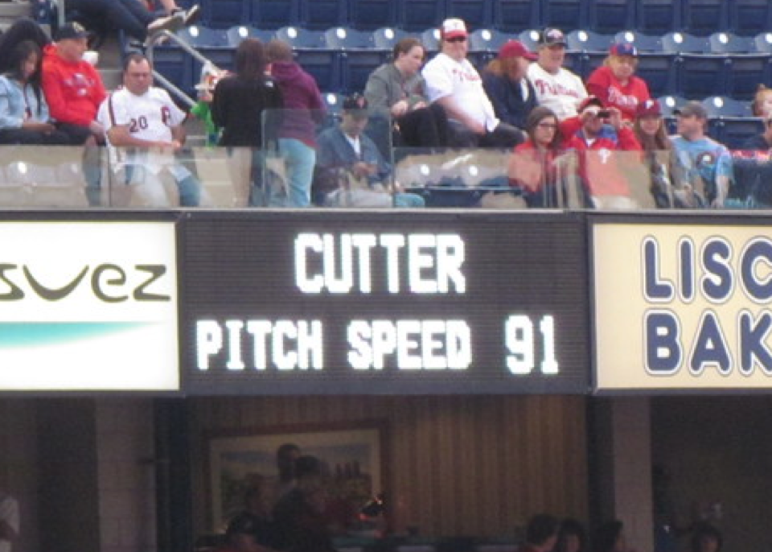{width="560"}</center>

## Data & Tools

-   **Data Source:** baseballsavant.mlb.com

-   **Collection Tool:** `pybaseball` (Open-source Python package by James LeDoux).

-   **Pre-classified Targets:** The dataset includes MLB's official pitch classifications to evaluate model accuracy.

-   **Filtered the Raw Dataset:** Down to 23 numeric predictor variables

|            |               |               |     |         |
|------------|---------------|---------------|-----|---------|
| pitch_type | release_speed | release_pos_x | ... | az      |
| FF         | 93.2          | -3.35         | ... | -11.643 |
| SL         | 87.3          | -3.33         | ... | -24.934 |
| CU         | 80.9          | -3.07         | ... | -40.127 |

-   **pitch_type:** Classification made by proprietary MLB algorithm

    -   Don't know exactly how they get this

## Research Questions

-   **Core Research Questions:**

    1.  How accurately can pitch types be predicted using purely kinematic data?
    2.  Which specific variables carry the most weight in predicting a pitch?
    3.  Can this modeling framework be easily scaled to evaluate other pitchers?

-   **Techniques:** Principal Component Analysis (PCA) and XGBoost Classification.

## Pitch Tracking Coordinate System

-   **x -\>** the horizontal distance, from the center of homeplate

-   **y -\>** the baseball's distance from home-plate

-   **z-\>** vertical distance, from middle of strikezone

    -   Ex: (x, z) = (0,0) would be the exact middle of the front of the strikezone

<center>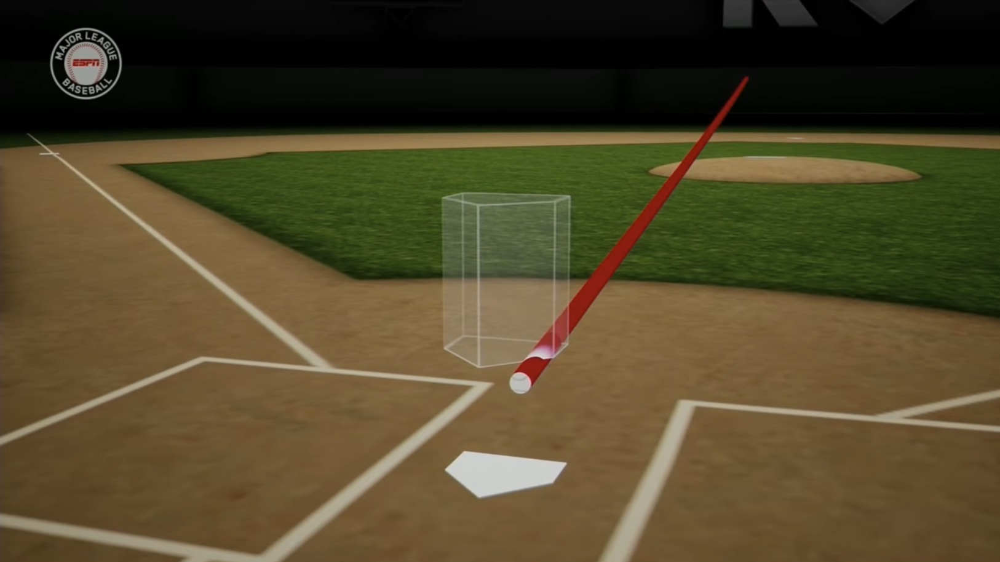{width="451"}</center>

## Predictor Variables (1)

-   **ax/y/z -\>** acceleration of the pitch in that respective direction

-   **release_pos_x/z -\>** x, z coordinates of were the ball leaves the pitchers hand

-   **release_pos_y -\>** how far away from the plate the pitcher relases the ball

<center>{width="641"}</center>

## Predictor Variables (2)

-   **plate_x,z -\>** where the pitch crosses home-plate in the x, z coordinates

-   **api_break_x/z -\>** Total Horizontal/Vertical Movement

    -   how far the pitch moves from x, z release point to x, z plate coords, after accounting for gravity and spin

<center>{width="641"}</center>

## Predictor Variables (3)

-   **pfx_x/z -\>** Induced Horizontal/Vertical Break

    -   The horizontal/vertical break between release point and home plate, compared to a pitch thrown at the same speed, just with no spin.

    -   Shows how the spin is manipulating the shape of the pitch.

<!-- -->

-   **release_extension -\>** Distance from rubber to where the pitcher releases the ball.

-   **Spin Axis vs Spin Rate (rpm)**

-   **Release Speed -\>** Velocity the moment it leaves pitchers hand.

-   **Effective Speed -\>** Perceived speed to a batter; pitcher extension affects this.

<center>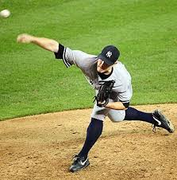{width="191"}</center>

## Brief Overview of Common Pitches

::::::: {layout="[25,25,25,25]"}
<div>

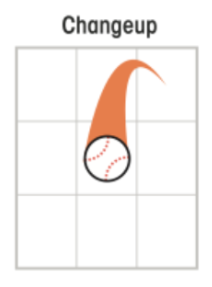{width="207"}

-   Changeup: Slower, tails /down

</div>

<div>

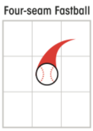{width="198"}

-   Fastball: Very Straight

</div>

<div>

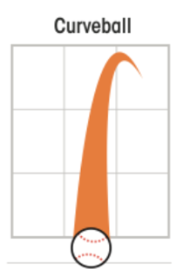{width="194"}

-   Curveball: Slow, lots of vertical movement

</div>

<div>

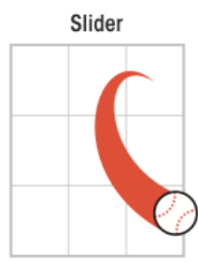{width="212"}

-   Slider: Moderate Speed, more horizontal movement

</div>
:::::::

```{r}
set.seed(326)
n <- nrow(full_data)

train_idx <- sample(1:n, size = 0.7 * n)
train_data <- full_data[train_idx, ]

remaining_data <- full_data[-train_idx, ]
n_rem <- nrow(remaining_data)
test_idx <- sample(1:n_rem, size = (2/3) * n_rem)

test_data <- remaining_data[test_idx, ]
val_data  <- remaining_data[-test_idx, ]
```

## Model Building

-   Until otherwise noted, will be using data from Tarik Skubal

    -   13,275 individual pitches

    -   LHP

-   **XGBoost:** A collection of decision trees, similar to that of a CART or Random Forest

-   Will be using 70/20/10 Train, Test, Validate sets.

## CART - Decision Tree

<center>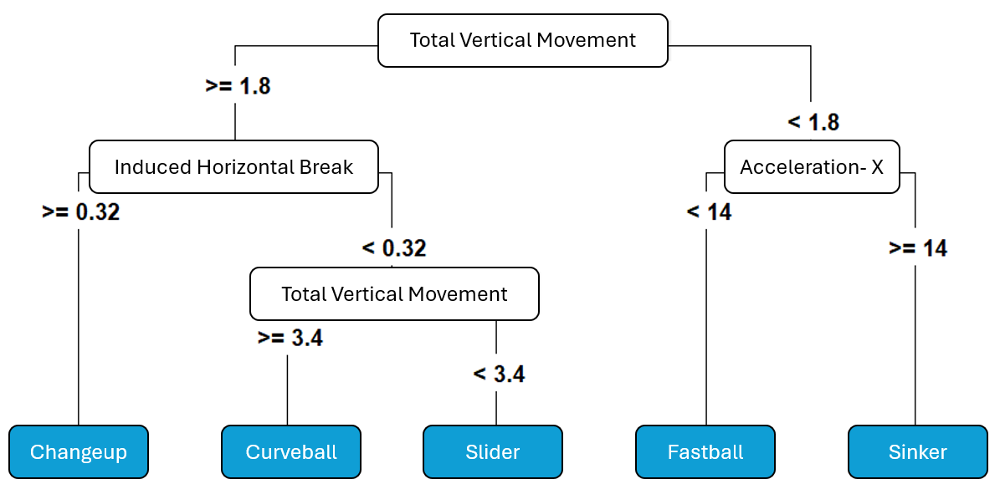</center>

## XGBoost Decision Tree - Example

<center>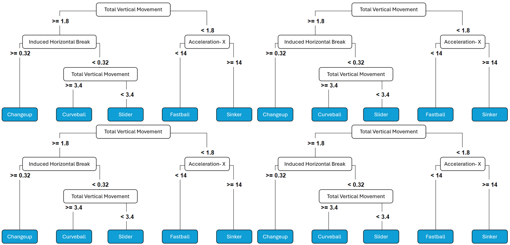</center>

. . .

-   XGBoost is a collection of "smart" decision trees

-   "Smart" in the way that each tree tries to "learn" from the mistakes of the tree before it.

## XGBoost- Model Performance

::::: {layout="[60, 40]"}
<div>

```{r}
#| fig-asp: 1
train_x <- data.matrix(select(train_data, -pitch_type))
train_y <- as.numeric(train_data$pitch_type) - 1

test_x  <- data.matrix(select(test_data, -pitch_type))
test_y  <- as.numeric(test_data$pitch_type) - 1

dtrain <- xgb.DMatrix(data = train_x, label = train_y)
dtest  <- xgb.DMatrix(data = test_x, label = test_y)

xgb_fit <- xgb.train(
  params = list(
    objective = "multi:softmax",
    num_class = length(unique(train_y))
  ),
  data = dtrain,
  nrounds = 100,
  verbose = 0
)

# pitch names
pitch_levels <- levels(test_data$pitch_type)

# predict and check accuracy of model
preds <- predict(xgb_fit, dtest)
preds_named <- factor(pitch_levels[preds + 1], levels = pitch_levels)
actuals_named <- factor(pitch_levels[test_y + 1], levels = pitch_levels)

# Save the confusion matrix to an object
cm_base <- confusionMatrix(preds_named, actuals_named)

# Plot the visual confusion matrix
as.data.frame(cm_base$table) %>%
  group_by(Reference) %>%
  mutate(Pct = Freq / sum(Freq)) %>%
  ggplot(aes(Prediction, Reference, fill = Pct)) +
  geom_tile() +
  geom_text(aes(label = scales::percent(Pct, accuracy = 1)), color = "white", size = 8) + 
  scale_fill_gradient(low = "gray87", high = "forestgreen", labels = scales::percent) + 
  labs(title = "Prediction Accuracy % by Pitch Type (Skubal)", x = "Predicted", y = "Actual") +
  theme_minimal() +
  theme(
    axis.title.x = element_text(size = 16, face = "bold"),
    axis.title.y = element_text(size = 16, face = "bold"),
    axis.text.x = element_text(size = 14),
    axis.text.y = element_text(size = 14),
    legend.position = "none"
  )
```

</div>

<div>

-   **Model Accuracy** = 99.4%

    -   Did an excellent job predicting all pitches.
    -   Very close to what the MLB algorithm would predict

</div>
:::::

## XGBoost - Variable Importance

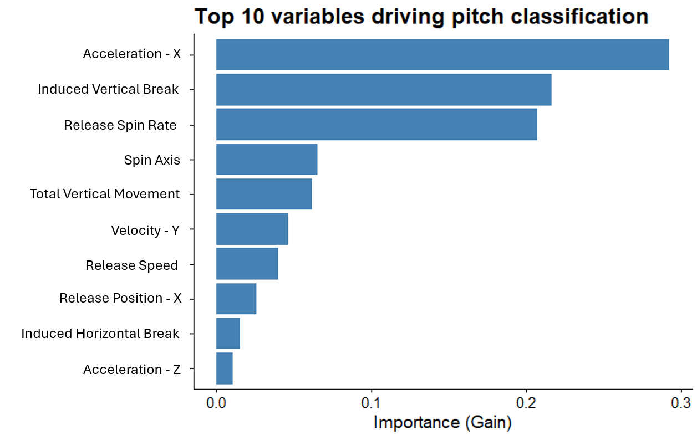

-   Variables with high importance have a high impact on seperating pitches from one another.

## What is PCA?

-   **23D to 2D:** Allows us to visualize 23 complex metrics on a simple 2D map.

<!-- -->

-   **Natural Clustering:** Reveals how pitches naturally group based on their physical traits.

-   **The Components:** 23 total components combine to explain 100% of the data's variance.

    -   We only plot **PC1 and PC2** because they capture the vast majority of that variance.

. . .

<center>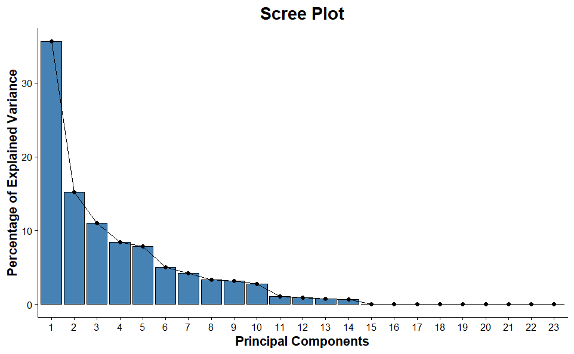{width="551"}</center>

## PCA - Biplot

-   Seems to be some clustering of points

<center>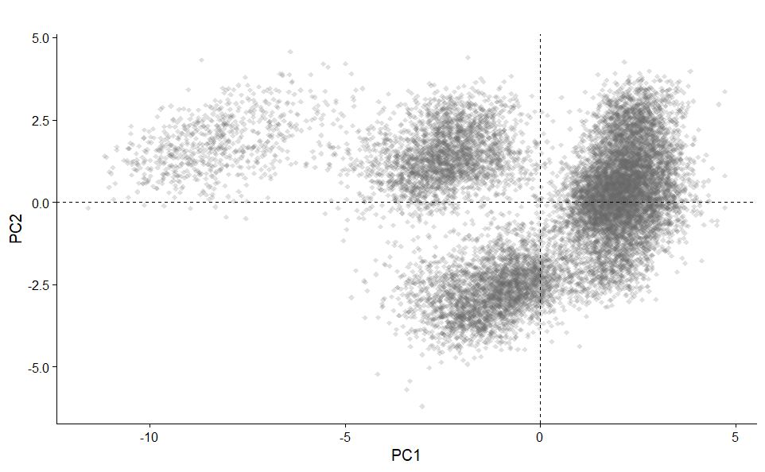{width="730"}</center>

## PCA - Biplot

-   Adding color, we see the each pitch seems to be clustering by type

<center>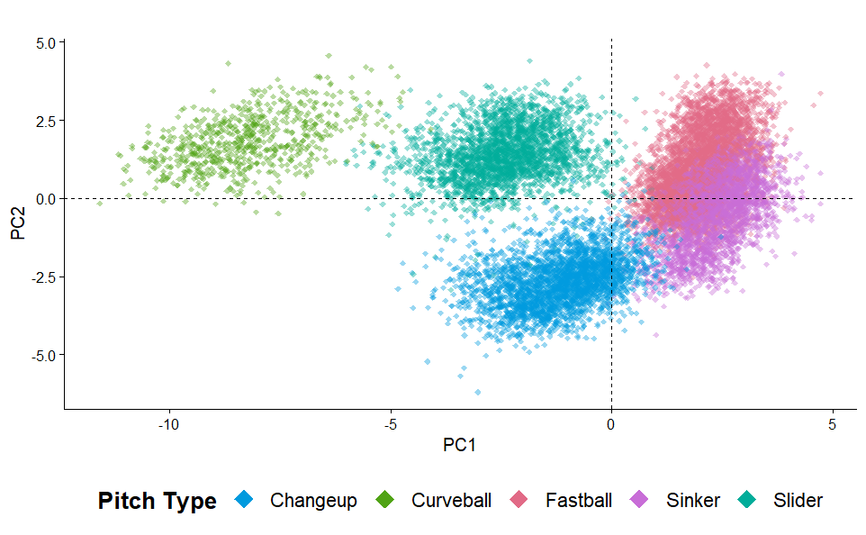{width="730"}</center>

## PCA - Biplot

-   **Direction:** If an arrow points toward a cluster, those pitches have **higher-than-average** values for that metric (e.g., higher Velocity or Spin).

<!-- -->

-   **Length:** Longer arrows indicate the variable has a **stronger influence** on how the pitches are separated.

<center>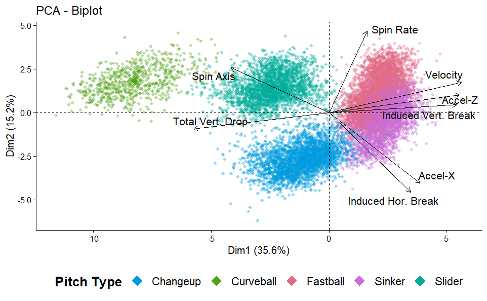{width="696"}</center>

## Model Generalization

*The model achieved 99% balanced accuracy on Skubal's pitches.*

**Can I apply Skubal's Model to predict what other pitchers are throwing?**

-   **Patrick Sandoval:** LHP. Throws the exact same 5 pitches as Skubal, but with a less elite movement profile.

-   **Jake Arrieta:** RHP. Retired, but threw mostly the same pitch mix.

## Generalization - Patrick Sandoval

::::: {layout="[60, 40]"}
<div>

```{r}
#| fig-asp: 1

sandoval <- read.csv("./data/sandoval_full.csv") %>%
  drop_na() %>%
  filter(pitch_type != "")

preds_sand <- sandoval %>% 
  select(colnames(train_x)) %>% 
  data.matrix() %>% 
  xgb.DMatrix() %>% 
  predict(xgb_fit, .) %>% 
  {levels(train_data$pitch_type)[. + 1]} 

u_levels <- union(unique(preds_sand), unique(sandoval$pitch_type))
pred_fac <- factor(preds_sand, levels = u_levels)
act_fac  <- factor(sandoval$pitch_type, levels = u_levels)

cm2 <- confusionMatrix(pred_fac, act_fac)

as.data.frame(cm2$table) %>%
  group_by(Reference) %>%
  mutate(Pct = Freq / sum(Freq)) %>%
  ggplot(aes(Prediction, Reference, fill = Pct)) +
  geom_tile() +
  geom_text(aes(label = scales::percent(Pct, accuracy = 1)), color = "white", size = 8) +
  scale_fill_gradient(low = "gray87", high = "forestgreen", labels = scales::percent) + 
  labs(title = "Prediction Accuracy % by Pitch Type (Sandoval)", x = "Predicted", y = "Actual") +
  theme_minimal() +
  theme(
    axis.title.x = element_text(size = 16, face = "bold"),
    axis.title.y = element_text(size = 16, face = "bold"),
    axis.text.x = element_text(size = 14),
    axis.text.y = element_text(size = 14),
    legend.position = "none"
  )
```

</div>

<div>

-   Model Accuracy = 94.0%

-   Sinker(SI) did alright, misclassified often as a fastball (FF) or changeup (CH).

-   Sweeper (ST) not in original model

    -   Misclassified as Slider (SL) or Curveball (CU)

</div>
:::::

## Generalization - Jake Arrieta

::::: {layout="[60, 40]"}
<div>

```{r}
#| fig-asp: 1
arrieta <- read.csv("./data/arrieta_full.csv") %>%
  drop_na() %>%
  filter(!pitch_type %in% c("", "IN")) # <-- Use ! and %in% here

preds_arrieta <- arrieta %>% 
  select(colnames(train_x)) %>% 
  data.matrix() %>% 
  xgb.DMatrix() %>% 
  predict(xgb_fit, .) %>% 
  {levels(train_data$pitch_type)[. + 1]} 

u_levels <- union(unique(preds_arrieta), unique(arrieta$pitch_type))
pred_fac <- factor(preds_arrieta, levels = u_levels)
act_fac  <- factor(arrieta$pitch_type, levels = u_levels)

cm4 <- confusionMatrix(pred_fac, act_fac)

as.data.frame(cm4$table) %>%
  group_by(Reference) %>%
  mutate(Pct = Freq / sum(Freq)) %>%
  ggplot(aes(Prediction, Reference, fill = Pct)) +
  geom_tile() +
  geom_text(aes(label = scales::percent(Pct, accuracy = 1)), color = "white", size = 8) +
  scale_fill_gradient(low = "gray87", high = "forestgreen", labels = scales::percent) + 
  labs(title = "Prediction Accuracy % by Pitch Type (Arrieta)", x = "Predicted", y = "Actual") +
  theme_minimal() +
  theme(
    axis.title.x = element_text(size = 16, face = "bold"),
    axis.title.y = element_text(size = 16, face = "bold"),
    axis.text.x = element_text(size = 14),
    axis.text.y = element_text(size = 14),
    legend.position = "none"
  )
```

</div>

<div>

-   Model Accuracy: 19.4%, very poor

-   RHP and LHP throw from opposite sides

    -   So when a RHP throws a slider it breaks left, while for a LHP it breaks right.

    -   This will cause classification issues when trying to split on x-axis based variables.

</div>
:::::

## Scaling Up - Random Sample

-   Can a more general model be built off a random sample of ALL pitchers?

-   Will draw a sample from a data frame with 1.5 million pitches from 2023-2024.

-   Right and Left Handed Models built separately for each.

-   At what sample size do we see a diminishing return.

```{r}
# Pre-filter for pitches that have enough data
full <- readRDS('./data/23_24_pitch_data.rds') %>%
  filter(pitch_type != "") %>%
  drop_na(pitch_type)

common_pitches <- full %>% 
  group_by(pitch_type) %>% 
  filter(n() >= 5000) %>% 
  ungroup() %>%
  pull(pitch_type) %>%
  unique()

full_filtered <- full %>%
  filter(pitch_type %in% common_pitches) %>%
  mutate(pitch_type = factor(pitch_type))

# grid of n
n_values <- c(1000, 2500, 5000, 10000, 15000, 25000, 35000)

# iterations
iterations <- 5

# data-R
data_R <- full_filtered %>% 
  filter(p_throws == "R") %>% 
  dplyr::select(-p_throws) %>% 
  droplevels()
data_R <- as.data.frame(data_R)

X_R <- data.matrix(dplyr::select(data_R, -pitch_type))
Y_R <- as.numeric(data_R$pitch_type) - 1
classes_R <- levels(data_R$pitch_type)
num_classes_R <- length(classes_R)

results_R <- numeric(length(n_values)) 

# data-L
data_L <- full_filtered %>% 
  filter(p_throws == "L") %>% 
  dplyr::select(-p_throws) %>% 
  droplevels()
data_L <- as.data.frame(data_L)

X_L <- data.matrix(dplyr::select(data_L, -pitch_type))
Y_L <- as.numeric(data_L$pitch_type) - 1
classes_L <- levels(data_L$pitch_type)
num_classes_L <- length(classes_L)

results_L <- numeric(length(n_values)) 
```

## How Large of a Sample of Pitches?

::::: {layout="[50, 50]"}
<div>

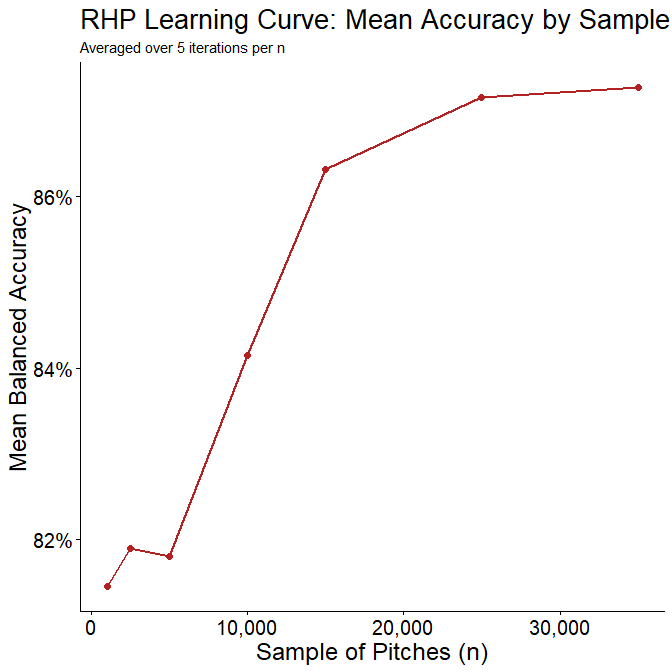

</div>

<div>

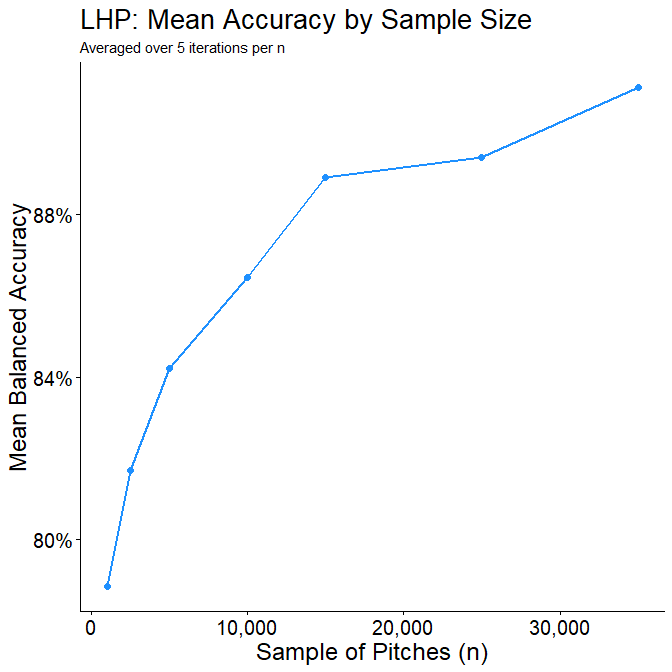

</div>
:::::

## RHP using Sample of 25,000

-   Model Accuracy: 86.9%

```{r}
# 1. Sample 25,000 pitches
set.seed(326)
sample_R <- data_R %>% slice_sample(n = 25000)

# 2. Create the 70/20/10 Split
n_R <- nrow(sample_R)
train_idx_R <- sample(1:n_R, size = 0.7 * n_R)
rem_idx_R   <- setdiff(1:n_R, train_idx_R)
# 20% of the total 100% is 2/3 of the remaining 30%
val_idx_R   <- sample(rem_idx_R, size = (2/3) * length(rem_idx_R)) 
test_idx_R  <- setdiff(rem_idx_R, val_idx_R)

train_data_R <- sample_R[train_idx_R, ]
val_data_R   <- sample_R[val_idx_R, ]
test_data_R  <- sample_R[test_idx_R, ]

# 3. Format for XGBoost
classes_R <- levels(sample_R$pitch_type)
num_classes_R <- length(classes_R)

train_x_R <- data.matrix(select(train_data_R, -pitch_type))
train_y_R <- as.numeric(train_data_R$pitch_type) - 1

val_x_R <- data.matrix(select(val_data_R, -pitch_type))
val_y_R <- as.numeric(val_data_R$pitch_type) - 1

test_x_R <- data.matrix(select(test_data_R, -pitch_type))
test_y_R <- as.numeric(test_data_R$pitch_type) - 1

dtrain_R <- xgb.DMatrix(data = train_x_R, label = train_y_R)
dval_R   <- xgb.DMatrix(data = val_x_R, label = val_y_R)
dtest_R  <- xgb.DMatrix(data = test_x_R, label = test_y_R)

# 4. Fit the Model (Using validation set for early stopping)
watchlist_R <- list(train = dtrain_R, eval = dval_R)

xgb_fit_R <- xgb.train(
  params = list(
    objective = "multi:softmax",
    num_class = num_classes_R,
    tree_method = "hist"
  ),
  data = dtrain_R,
  nrounds = 100,
  watchlist = watchlist_R,
  early_stopping_rounds = 10,
  verbose = 0
)

# 5. Evaluate Balanced Accuracy on Test Set
preds_R <- predict(xgb_fit_R, dtest_R)
pred_fac_R <- factor(classes_R[preds_R + 1], levels = classes_R)
actual_fac_R <- factor(classes_R[test_y_R + 1], levels = classes_R)

cm_R <- confusionMatrix(pred_fac_R, actual_fac_R)

# 1. Convert Confusion Matrix table to a dataframe
cm_df_R <- as.data.frame(cm_R$table) %>%
  group_by(Reference) %>%
  mutate(Pct = Freq / sum(Freq)) %>%
  ungroup()

# 2. Plot without legend
ggplot(cm_df_R, aes(x = Prediction, y = Reference, fill = Pct)) +
  geom_tile() +
  geom_text(aes(label = scales::percent(Pct, accuracy = 1)), 
            color = "white", 
            size = 6) + 
  scale_fill_gradient(low = "gray87", 
                      high = "forestgreen", 
                      labels = scales::percent) + 
  labs(
    title = "Prediction Accuracy % by Pitch Type",
    x = "Predicted Pitch Type", 
    y = "Actual Pitch Type"
  ) +
  theme_minimal() +
  theme(
    axis.title.x = element_text(size = 14, face = "bold"),
    axis.title.y = element_text(size = 14, face = "bold"),
    axis.text.x = element_text(size = 12, angle = 45, vjust = 1, hjust = 1),
    axis.text.y = element_text(size = 12),
    panel.grid = element_blank(),
    legend.position = "none" # <--- This removes the color scale legend
  )

```

## LHP using Sample of 25,000

-   Model Accuracy: 90.6%

```{r}
# 1. Sample 25,000 pitches
set.seed(326)
sample_L <- data_L %>% slice_sample(n = 25000)

# 2. Create the 70/20/10 Split
n_L <- nrow(sample_L)
train_idx_L <- sample(1:n_L, size = 0.7 * n_L)
rem_idx_L   <- setdiff(1:n_L, train_idx_L)
val_idx_L   <- sample(rem_idx_L, size = (2/3) * length(rem_idx_L)) 
test_idx_L  <- setdiff(rem_idx_L, val_idx_L)

train_data_L <- sample_L[train_idx_L, ]
val_data_L   <- sample_L[val_idx_L, ]
test_data_L  <- sample_L[test_idx_L, ]

# 3. Format for XGBoost
classes_L <- levels(sample_L$pitch_type)
num_classes_L <- length(classes_L)

train_x_L <- data.matrix(select(train_data_L, -pitch_type))
train_y_L <- as.numeric(train_data_L$pitch_type) - 1

val_x_L <- data.matrix(select(val_data_L, -pitch_type))
val_y_L <- as.numeric(val_data_L$pitch_type) - 1

test_x_L <- data.matrix(select(test_data_L, -pitch_type))
test_y_L <- as.numeric(test_data_L$pitch_type) - 1

dtrain_L <- xgb.DMatrix(data = train_x_L, label = train_y_L)
dval_L   <- xgb.DMatrix(data = val_x_L, label = val_y_L)
dtest_L  <- xgb.DMatrix(data = test_x_L, label = test_y_L)

# 4. Fit the Model
watchlist_L <- list(train = dtrain_L, eval = dval_L)

xgb_fit_L <- xgb.train(
  params = list(
    objective = "multi:softmax",
    num_class = num_classes_L,
    tree_method = "hist"
  ),
  data = dtrain_L,
  nrounds = 100,
  watchlist = watchlist_L,
  early_stopping_rounds = 10,
  verbose = 0
)

# 5. Evaluate Balanced Accuracy on Test Set
preds_L <- predict(xgb_fit_L, dtest_L)
pred_fac_L <- factor(classes_L[preds_L + 1], levels = classes_L)
actual_fac_L <- factor(classes_L[test_y_L + 1], levels = classes_L)

cm_L <- confusionMatrix(pred_fac_L, actual_fac_L)
# 1. Convert the Confusion Matrix for Lefties to a dataframe
cm_df_L <- as.data.frame(cm_L$table) %>%
  group_by(Reference) %>%
  mutate(Pct = Freq / sum(Freq)) %>%
  ungroup()

# 2. Create the heatmap for Left-Handed Pitchers
ggplot(cm_df_L, aes(x = Prediction, y = Reference, fill = Pct)) +
  geom_tile() +
  geom_text(aes(label = scales::percent(Pct, accuracy = 1)), 
            color = "white", 
            size = 6) + 
  scale_fill_gradient(low = "gray87", 
                      high = "forestgreen", 
                      labels = scales::percent) + 
  labs(
    title = "Prediction Accuracy % by Pitch Type",
    x = "Predicted Pitch Type", 
    y = "Actual Pitch Type"
  ) +
  theme_minimal() +
  theme(
    axis.title.x = element_text(size = 14, face = "bold"),
    axis.title.y = element_text(size = 14, face = "bold"),
    axis.text.x = element_text(size = 12, angle = 45, vjust = 1, hjust = 1),
    axis.text.y = element_text(size = 12),
    panel.grid = element_blank(),
    legend.position = "none" # Removed as requested
  )
```

## RHP vs LHP Variable Importance

```{r}
# Calculate the importance matrix for the RHP model
importance_matrix_R <- xgb.importance(feature_names = colnames(train_x_R), model = xgb_fit_R)

# Convert to a dataframe and plot the top 10 variables using ggplot2
rhp_imp <- as.data.frame(importance_matrix_R) %>%
  slice_head(n = 10) %>% # Keep only the top 10 most important to avoid clutter
  ggplot(aes(x = reorder(Feature, Gain), y = Gain)) +
  geom_col(fill = "steelblue") +
  coord_flip() + # Flip axes to make variable names easy to read
  labs(
    title = "10 Most Important Variables (RHP)",
    x = "",
    y = "Importance (Gain)"
  ) +
  theme_classic() +
  theme(
    plot.title = element_text(size = 18, face = "bold"),
    axis.title = element_text(size = 14),
    axis.text = element_text(size = 12)
  )
```

<center>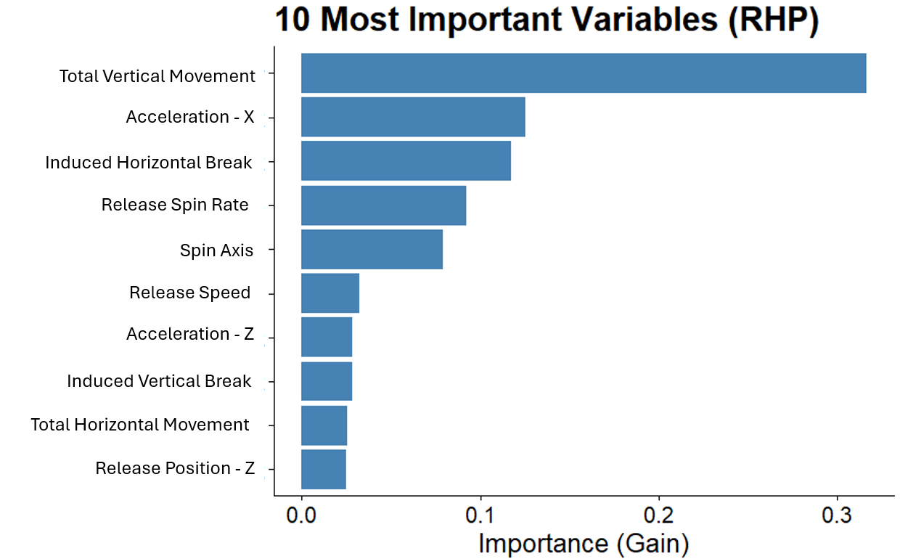{width="475"}</center>

```{r}
# Calculate the importance matrix for the LHP model
importance_matrix_L <- xgb.importance(feature_names = colnames(train_x_L), model = xgb_fit_L)

# Convert to a dataframe and plot the top 10 variables using ggplot2
lhp_imp <- as.data.frame(importance_matrix_L) %>%
  slice_head(n = 10) %>% # Keep only the top 10 most important to avoid clutter
  ggplot(aes(x = reorder(Feature, Gain), y = Gain)) +
  geom_col(fill = "steelblue") +
  coord_flip() + # Flip axes to make variable names easy to read
  labs(
    title = "10 Most Important Variables (LHP)",
    x = "",
    y = "Importance (Gain)"
  ) +
  theme_classic() +
  theme(
    plot.title = element_text(size = 18, face = "bold"),
    axis.title = element_text(size = 14),
    axis.text = element_text(size = 12)
  )
```

<center>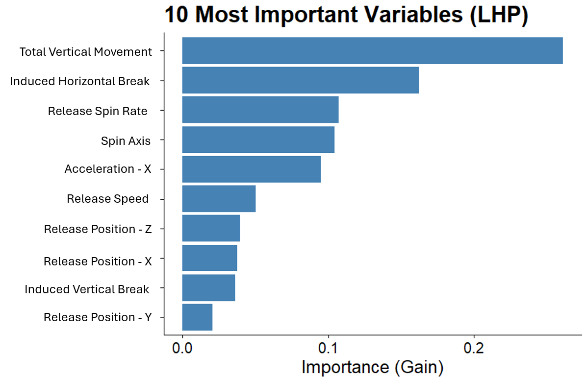{width="475"}</center>

## Takeaways

-   The Individualized Model did the Best (99.4% Accuracy)

-   PCA allows us to see the clustering of pitches and the characteristics of those pitches.

-   Splitting by Handedness allowed for a more generalizable model (87-90% Accuracy)

-   Most Important Variables:

    -   Spin: Rate/Axis

    -   Movement: Vertical Movement, Acceleration-X, Horizontal Movement

## Questions?

## Sources

<https://i.redd.it/68jn94t68zgb1.png>

<https://rocklandpeakperformance.com/wp-content/uploads/2019/10/Pitch-Shapes.png>

notes:

PCA section before or after Skubal Model building?
